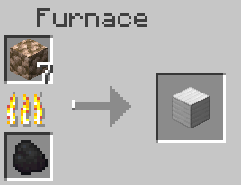
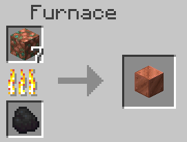
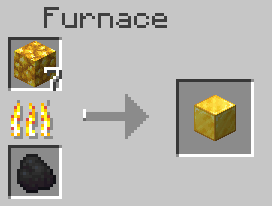
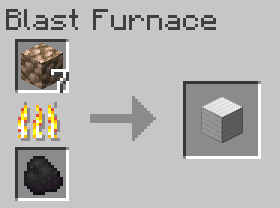
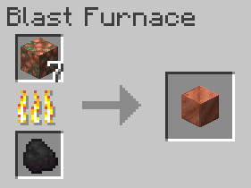
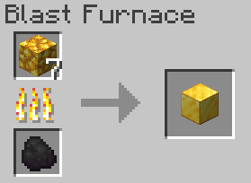

# SmeltRawOreBlocks
SmeltRawOreBlocks is a datapack that lets you smelt raw ore blocks (duh).
 
 
Smelting a raw ore block takes the same amount of time as smelting 9 raw ore items (1 raw ore block = 9 raw ore items).

# Screenshots
### Furnace

### Blast furnace

